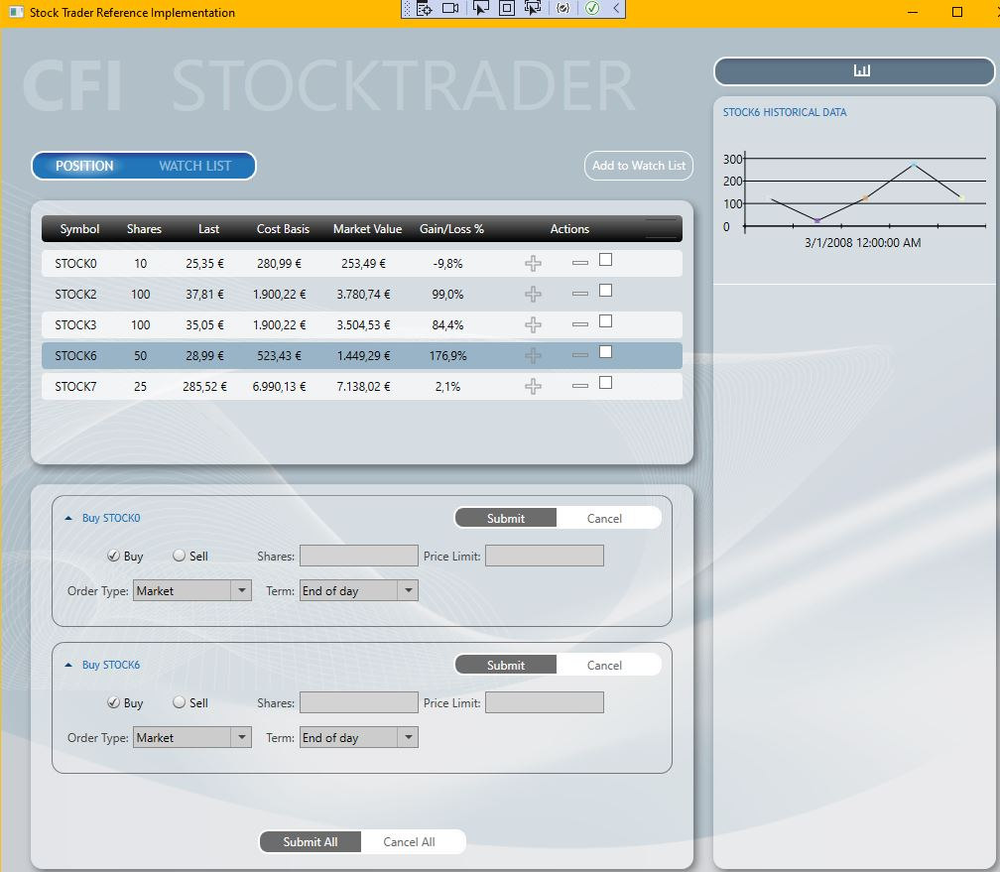
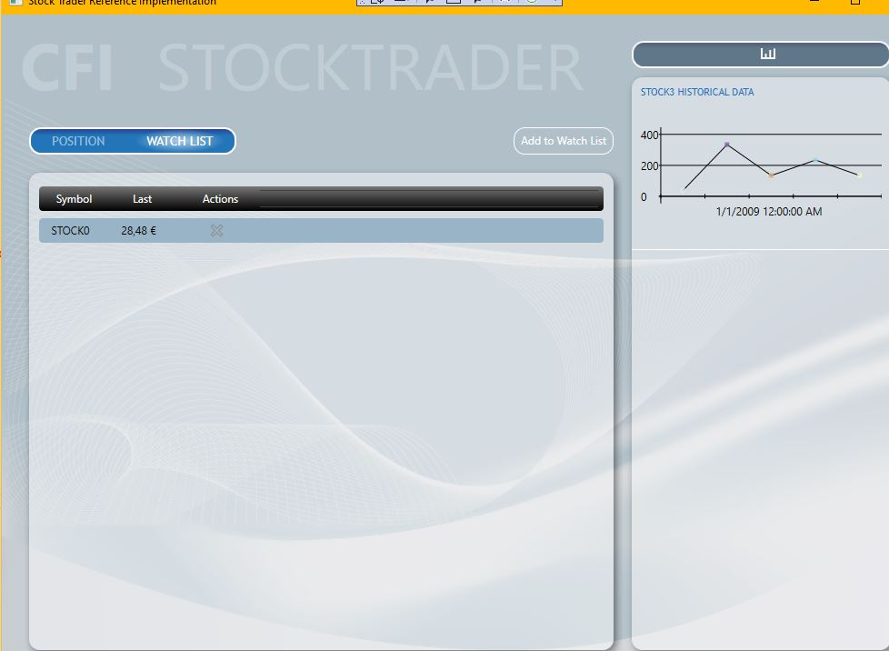
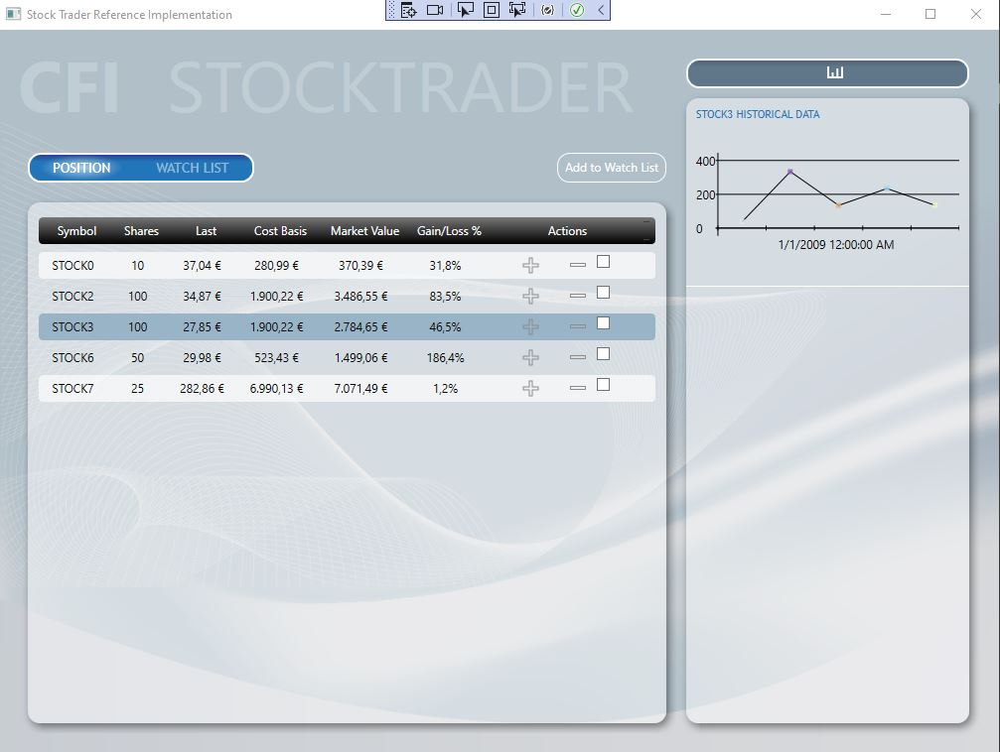

# PrismSample-StockTraderRI-Unity

This is a WPF Prism sample for StockTrader Reference Implementation. Originally it was created with MEF. This version recreates it with Unity DI and .Net 6.0

Original from [here]()
# Pics

 
